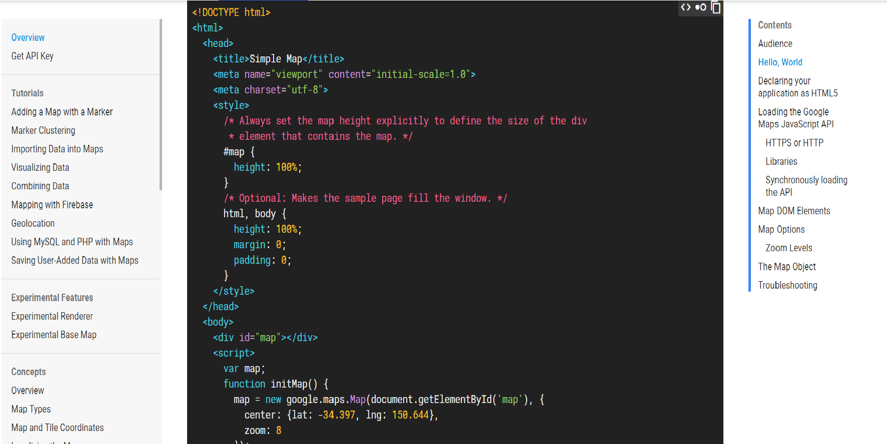

# Google-Map-API
## This is a practice site-non commercial
## Este sito web is solo practico no comercial

### *Image Sample*


### *Technologies*
> JavaScript

```js
 // add marker function
 // This function display the marker from an array of objects 'coordinates of places'
    function addMarker(props){
        var marker = new google.maps.Marker({
        position:props.coord,
        map: map
    });
```

>> HTML 5

> Google Services

>> Google API Key

>> Google Documentation

[Google Developer Documentation](https://developers.google.com/maps/documentation/javascript/tutorial#api_key)


